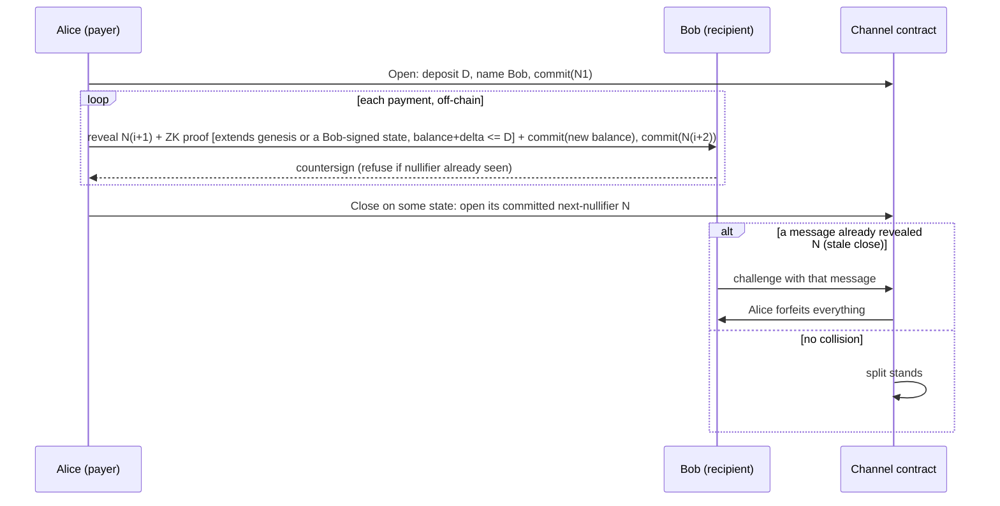
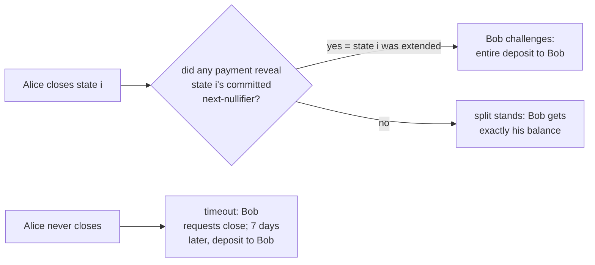

# zk-payments-confetti

Machine-checked security for **zk payment channels**: write the missing
literature, formalize the protocol, verify it in Lean 4.

> **Disclaimer.** This project is AI-driven end to end: the research, the
> definitions, the proofs, and most of the prose were produced by agents,
> and agent-produced research contains mistakes. Treat any claim the Lean
> kernel has not checked as unverified. Several contributors' work reaches
> this repo through the maintainer's agent and lands under the
> maintainer's commits, so commit authorship (`dmarzzz`) is not credit:
> the protocol design in `PROTOCOL.md` is an external contribution
> recorded verbatim, and the largest proof campaign (PR #2) is
> `lalalune`'s.

## The protocol at a glance

Alice pays Bob per request. Bob cannot link two payments to the same
sender or channel; he only ever learns "someone paid me δ". One
mechanism, a hash chain of nullifiers, provides both duplicate detection
and cheat detection.

Why Bob never loses money:

## Read this, in order

1. **[`PROTOCOL.md`](PROTOCOL.md)** — the protocol. A unidirectional
   payment channel with per-request anonymity and hidden balances, in a
   post-quantum setting (STARKs + hashes + a PQ signature verified inside
   the proof; no elliptic curves, no FHE). One mechanism, a nullifier
   chain, does both duplicate detection and collision-based stale-close
   detection. ~5 minutes.
2. **[`STATUS.md`](STATUS.md)** — what is actually proved and attested
   today, and what is not. ~2 minutes.
3. **[`ROADMAP.md`](ROADMAP.md)** — what to prove next: the five open
   definitional issues (G1–G5) that block the campaign, the ranked
   theorem obligations, and which existing machinery seeds each one.
4. **`lean/Zkpc/`** — the Lean. `make build` kernel-checks everything
   (equivalently `cd lean && lake exe cache get && lake build`; see
   [`CONTRIBUTING.md`](CONTRIBUTING.md) for the rules: zero `sorry`, no
   axioms outside `lean/Zkpc/Assumptions.lean`, secret-averaged certificates
   only).

Everything else — the adversarial definition-review record ("gates"),
audits, the superseded rev-11 spec, the paper drafts, raw literature
reports — lives under [`research/`](research/):
`research/processed/` is the distilled reading
([what the gate reviews decided](research/processed/decisions.md),
[the method](research/processed/method.md),
[the verified field report](research/processed/field-report.md));
`research/raw/` is the unabridged record.

## Layout

| Path | What it is |
|---|---|
| `PROTOCOL.md` | The design of record (verbatim external contribution). Pre-freeze: G1–G5 open. |
| `STATUS.md` | Current proof + attestation state. |
| `ROADMAP.md` | The worklist: Spec-v2 gate rounds, then the ranked obligations. |
| `CONTRIBUTING.md` | Prover's guide: model boundary, rules, conventions. |
| `lean/Zkpc/`, `tla/` | The Lean formalization and the TLA+ model. |
| `research/processed/` | Distilled: gate decisions, method, field report. |
| `research/raw/` | Unabridged: gate logs, audits, rev-11 spec, process docs. |
| `research/paper/` | The systematization draft (rev-11-scoped; restructure pending). |

## Provenance

Born from the payment-design question in the reputation-gated egress post
(github.com/dmarzzz/reputation-gated-onion-egress) and a conversation
about whether zk payment channel literature should exist. The method —
why agent-produced proofs can be trusted at all, and where human judgment
still has to sit — is [`research/processed/method.md`](research/processed/method.md).
